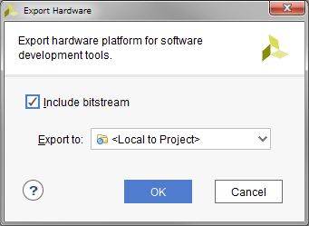
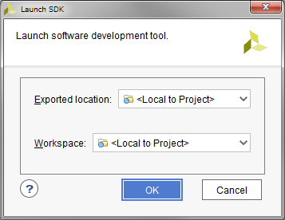
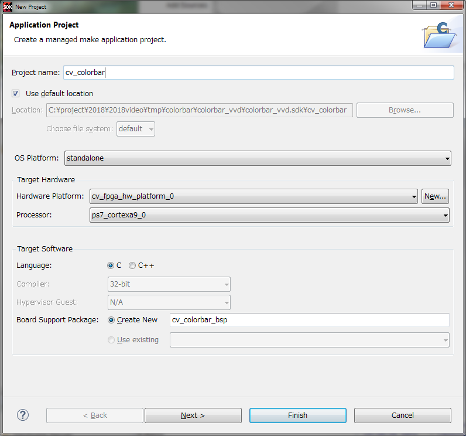
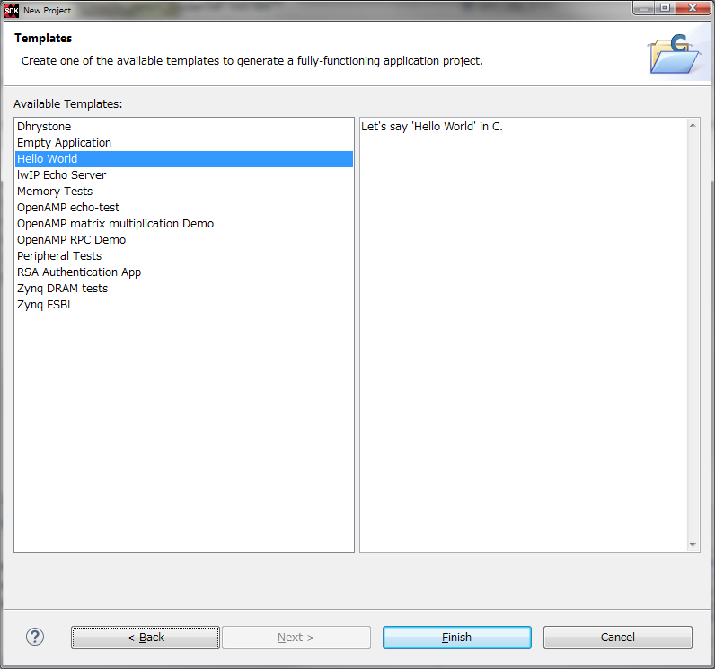
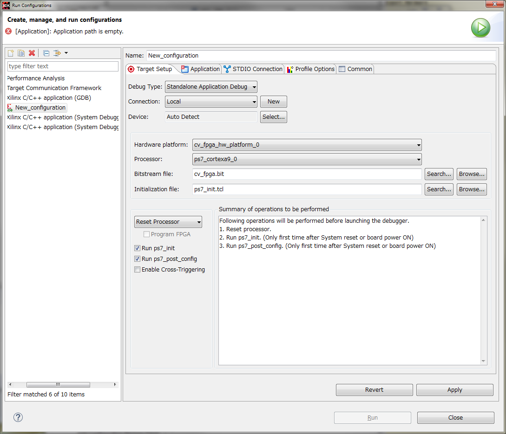
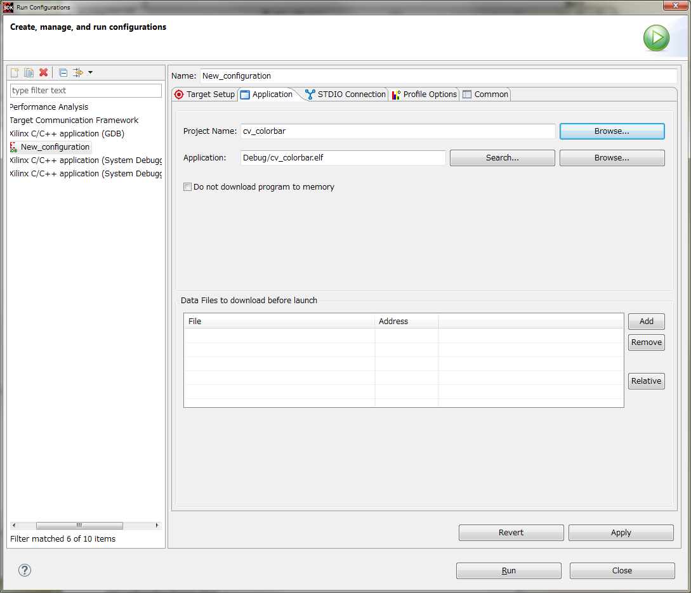

# Arty Z7-20からカラーバー信号を出力する

HDMI信号のお勉強を目的に、カラーバーを出力するRTLを作ってみた。
DigilentからHDMI-outのリファレンスがあるけど、多機能・高機能のため
分かりにくかったのでいちから作ってみた。

ロジックの最小化など考えておらず、自分がわかりやすいと思う記述なのであしからず。

# Vivadoプロジェクト

Vivadoを立ち上げ、Tcl Consoleからcolorbar_proj.tclがあるフォルダに移動する。

cd /project/folder

colorbar_proj.tclを読み込む

source colorbar_proj.tcl

あとはGenerate Bitstreamを実行し、FPGAをコンフィグレーションする。

一部タイミング違反がでるが、325MHzクロックでLチカをするためのカウンタなのでひとまず無視する。

# SDK

ZynqはFPGAをコンフィグレーションしてもPS部をコンフィグレーションしないとPL部が動かない。
このRTLはソフトウェアからの設定を全くしないので、XSDKのテンプレートとして用意されている
helloworldをそのまま使う。ようはps7_init.tclが実行されればそれでよい。

一応手順を以下に示す。

VivadoでFile->Export->Export Hardwareを実行する。Include Btistreamにチェックを入れて実行。

VivadoでFile->Launch SDKを実行する。

XSDKからFile->New->Application Projectを実行する。
スクリーンショットの通りに設定する。

XSDKからRun->Run Configurationを実行する。
左ペインのXilinx C/C++ application (GDB)を右クリックしてNewする。
Target SetupとApplicationのタブをスクリーンショットの通りに設定する。

Runを押して実行する。
